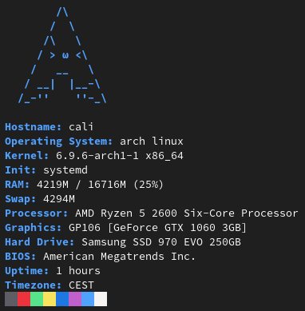

# Gofetch
A simple and pretty command-line system information tool written in Go.

# Requirements

-Go 1.22.4 or newer

-A Linux-based Operating System

# Sample screenshot

# Known issues

error at the index of graphInfo table - from what I know it depends of your hardware. it should mostly work without any issues but if it happens somehow, all you have to do it to change the array index to 1

# Credits

Every ascii art is taken from https://github.com/ad-oliviero/uwufetch
