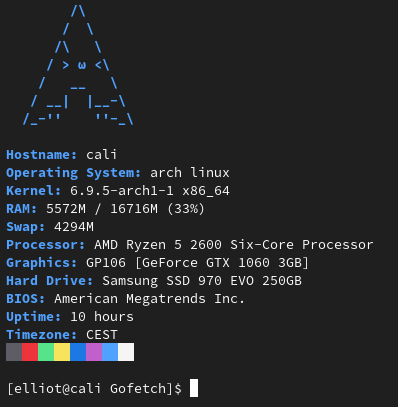

# Gofetch
A simple and pretty command-line system information tool written in Go.

# Requirements

-Go 1.22.4 or newer

-A Linux-based Operating System

# Sample screenshot

# Credits

Every ascii art is taken from https://github.com/ad-oliviero/uwufetch
